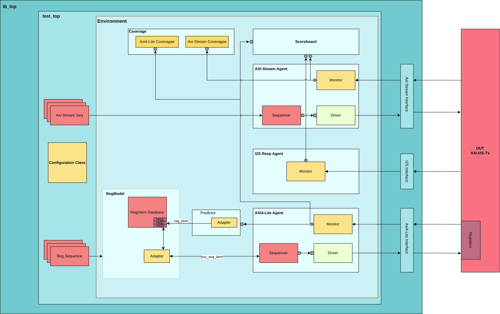

# AXI-I2S Transmitter Verification Environment

This repository provides a comprehensive UVM-based verification environment for the AXI-I2S Transmitter, ensuring functionality, protocol compliance, and performance validation. The environment supports both AXI4-Lite (for register access) and AXI-Stream (for data streaming) interfaces.

---

## **Architecture Overview**

The verification architecture includes the following components:
- **Testbench Top:** Orchestrates interactions between the DUT and verification components.
- **AXI4-Lite Agent:** Handles configuration and register-level transactions.
- **AXI-Stream Agent:** Manages high-speed streaming data transactions.
- **I2S Agent:** Monitors and verifies I2S-specific output signals (`SCLK`, `LRCLK`, and `SDATA`).
- **Scoreboard:** Compares DUT outputs with expected results.
- **Coverage:** Tracks functional and protocol coverage for AXI4-Lite and AXI-Stream interfaces.
- **Environment Class:** Sets up and integrates agents, monitors, coverage, and scoreboard.
- **Test Sequences:** Provides stimulus for functional and directed scenarios.

  
*Image: AXI-I2S Transmitter Verification Architecture*

---

## **Setup Instructions**

### **Prerequisites**
1. **Vivado Design Suite:** Ensure Vivado is installed and accessible in your system's PATH.
2. **Clone the Repository:**  
   ```bash
   git clone <repository_url>
   cd <repository_directory>
---

## Prerequisites
Before using the Makefile, ensure you have the following set up in your environment:
- **UVM Library:** Verify that the UVM library is included in your Vivado installation.
- **i2s_tb_top_vlog.prj:** Update Vivado installation path in this file for include
---

## How to Use

### 1. **Clone or Copy the Repository**
   Clone or copy the Makefile and associated project files into your local working directory.

### 2. **Configure the Makefile**
   Update the following variables in the Makefile as needed (not required if repository is cloned):
   - `SRC_DIR`: Path to your design source directory.
   - `PRJ_FILE`: Vivado project file for your testbench.
   - `TCL_BATCH`: Path to the TCL file for simulation settings.
   - `WCFG_FILE`: Path to your waveform configuration file (optional).
   - `COV_DIR`: Directory to store coverage databases.
   
### 3. **Run Makefile Targets**
   Use the following commands to execute various stages of the simulation:

   #### Compile the Design
   This compiles the design and testbench files into simulation-ready objects. Logs are stored in logs/<your_test_name>/compile.log.
   ```bash
   make compile
```
   #### Elaborate the Design
   This elaborates the compiled design files and generates the simulation snapshot. Logs are stored in logs/<your_test_name>/elaborate.log.
   ```bash
   make elaborate
```
   #### Simulate the Design
   Replace <your_test_name> with the name of your UVM test and <UVM_VERBOSITY_LEVEL> with the name of verbosity level you want to simulate by default verbosity is set to UVM_LOW. This runs the simulation with the specified test and stores results 
   in logs/<your_test_name>/simulate.log.
   If no test is specified, the default sanity_test will run.
   ```bash
   make simulate TEST=<your_test_name> VERBOSITY=<UVM_VERBOSITY_LEVEL>
```
   #### Clean Up
   Removes all generated files and logs, cleaning the workspace.
   ```bash
   make clean
```
---
   ### Example Usage
   Here is an example workflow for running a UVM test:
   Run the simulation with a custom test:
   ```bash
   make simulate TEST=ral_test
```
   Check logs in logs/ral_test/ for details. View waveforms using the generated .wdb or .vcd files in logs/ral_test/wave.
   Verbosity is not defined in above test so by default it will be treated as UVM_LOW

## How to view waveforms Using Vivado and GTKWAVE
### 1. **Using Vivado**
   Open the terminal in logs/ral_test/wave and run this command.
   
 ```bash
    xsim i2s_tx_tb_top_behav.wdb -view i2s_tx_tb_top_behav.wcfg -gui
 ```

### 1. Using GTKWAVE
   Open the terminal in logs/ral_test/wave and run this command.
   
   ```bash
    gtkwave dump.vcd -T siglist_wave.tcl
   ```


